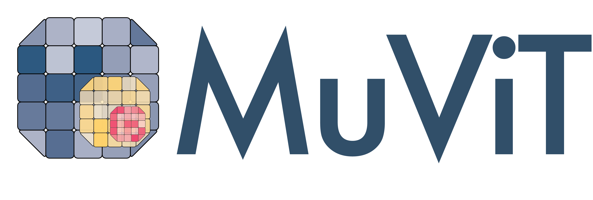

<div align="center">
  
</div>

# _MuViT_: Multi-Resolution Vision Transformers for Learning Across Scales in Microscopy 

Official implementation of _MuViT_ (CVPR 2026), a vision transformer-based architecture designed to process gigapixel microscopy images by jointly modelling multiple scales with a single encoder. For technical details please check the preprint (coming _very_ soon!). 

This repository contains the implementation of the _MuViT_ architecture, along with the multi-resolution Masked Autoencoder (MAE) pre-training framework.

## Overview


Modern microscopy yields gigapixel images capturing structures with hierarchical organization spanning from individual cell morphology to broad tissue architecture. A central challenge in analyzing those images is that models must trade off effective context against spatial resolution. Standard CNNs or ViTs typically operate on single-resolution crops, with hierarchical feature pyramids being built from a single view.

To tackle this, _MuViT_ is designed to jointly process FOVs of the same image at different physical resolutions within a unified encoder. This is achieved by jointly feeding the different scales to the model and adding consistent _world-coordinate_ RoPE, a simple yet effective mechanism which ensures that the same physical location receives the same positional encoding across scales. This enables the attention mechanism to work across different scales, allowing integration of wide-field context (_e.g._ anatomical) with high-resolution detail (_e.g._ cellular) for solving dense computer vision tasks, like segmentation.

Furthermore, _MuViT_ extends the Masked Autoencoder (MAE) pre-training framework to a multi-resolution setting to learn powerful representations from unlabeled large-scale data. This produces highly informative, scale-consistent features that substantially accelerate convergence and improve sample efficiency on downstream tasks.


## Installation

Simply clone the repository, create a new Python environment (with `conda` or alike) and install the repository in editable mode:

```console
mamba create -y -n muvit python=3.12
git clone git@github.com:weigertlab/muvit.git
pip install -e ./muvit
```

## Usage

### Creating a _MuViT_ dataset

All PyTorch datasets to be used for _MuViT_ should inherit from `muvit.data.MuViTDataset`, which will run sanity checks on _e.g._ the output format to ensure consistency. It requires implementing the following methods and properties (check the implementation of the [`MuViTDataset` class](./muvit/data.py) for more details):


```python
from muvit.data import MuViTDataset

class MyMuViTDataset(MuViTDataset):
    def __init__(self):
        pass

    def __len__(self) -> int:
        # number of samples in the dataset
        return 42 # change accordingly

    @property
    def n_channels(self) -> int:
        # number of channels in the input images
        return 1 # change accordingly

    @property
    def levels(self) -> Tuple[int, ...]:
        # return resolution levels (in ascending order)
        return (1,8,32) # change accordingly

    @property
    def ndim(self) -> int:
        # returns number of spatial dimensions
        return 2 # change accordingly

    def __getitem__(self, idx) -> dict:
        # should return a dictionary like
        return {
            "img": img, # torch tensor of shape (L,C,Y,X)
            "bbox": bbox, # torch tensor of shape (L,2,Nd) where Nd is the number of spatial dimensions (e.g. 2)
        } 
```

#### Bounding box format

The `bbox` (bounding box) tensor defines the exact physical extent (field of view) of each image crop within a shared _world-coordinate_ system, which we define as the highest resolution pixel space. For a single dataset sample, it must have the shape $(L, 2, N_d)$, where $L$ is the number of resolution levels and $Nd$ is the number of spatial dimensions (e.g., 2). The second dimension, always of size 2 represents the boundaries of the crop: index 0 contains the minimum coordinates (top-left, i.e., `[y_min, x_min]`) and index 1 contains the maximum coordinates (bottom-right, i.e., `[y_max, x_max]`). Providing them as accurately as possible is crucial, as _MuViT_ relies on them to geometrically align the different resolutions.

### Multiscale MAE pre-training

In order to pre-train an MAE model on your created dataset, you can simply instantiate the `MuViTMAE2d` class and pass the dataloaders to its `.fit` method. Most of the parameters are customizable (_e.g._ number of layers, patch size, etc.). For more information please check the implementation of the [MuViTMAE2d class](./muvit/mae.py). We use PyTorch Lightning to handle the training logic.
For example:

```python
import torch

from muvit.data import MuViTDataset
from muvit.mae import MuViTMAE2d

class MyMuViTDataset(MuViTDataset):
    # implement the dataset as shown above
    pass

train_ds = MyMuViTDataset(args1)
val_ds = MyMuViTDataset(args2)

model = MuViTMAE2d(
    in_channels=train_ds.n_channels,
    levels=train_ds.levels,
    patch_size=8,
    num_layers=12,
    num_layers_decoder=4,
    ... # other parameters
)

train_dl = torch.utils.data.DataLoader(train_ds, batch_size=16, shuffle=True)
val_dl = torch.utils.data.DataLoader(val_ds, batch_size=16, shuffle=False)
model.fit(train_dl, val_dl, output="/path/to/pretrained", num_epochs=100, ...)
```

### Using a pre-trained encoder
After pre-training the MAE model, you can use the encoder for downstream tasks or feature extraction. To get the encoder from the MAE pre-trained model, you can simply load it using our helper function and access it via the `encoder` attribute:

```python
from muvit.mae import MuViTMAE2d

encoder = MuViTMAE2d.from_folder("/path/to/pretrained").encoder
```

which returns a `MuViTEncoder` PyTorch module that is pluggable into any downstream pipeline. The encoder expects an input tensor of shape $(B,L,C,Y,X)$ (where $L$ denotes the number of resolution levels) along with the world coordinates, which are given as a "bounding-box" tensor of shape $(B,L,2,2)$ (for 2D). Note that not giving an explicit bounding box might cause undefined behaviour. The output of an encoder is a tensor of shape $(B,N,D)$ where $N$ is the number of tokens and $D$ is the embedding dimension.

The method `compute_features()` of an encoder will run a forward pass on a given multi-scale tensor and corresponding bounding boxes and return the features in a spatially structured format $(B,L,D,H',W')$ where $H'=\frac{H}{P}$ and $W'=\frac{W}{P}$, with $P$ being the patch size.

## Citation

If you use this code for your research, please cite the following article:

```
TODO
```
